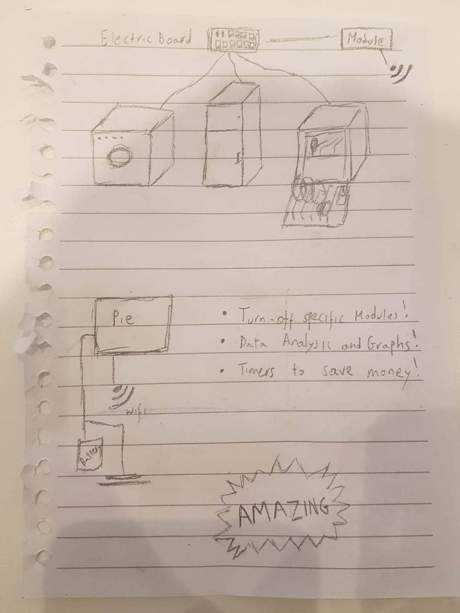

# IDD-Final-Project

**Team**

Frans Fourie fjf46  
Konstantinos Karras Kallidromitis kk984

**Project Idea**

Create a power management system. The system will have a central server that is connected to the local building wifi. There will then be small modules installed in every DB board thru out a building that measures the power consumption of that DB board as well as be connected to a relay board that can control power access to some of the non critical components connected to the DB.

The modules will send back there measurements to the central unit. The central unit will colllect all the data and can send commands to the modules for them to turn things on and off. The system will also have timer capabilities. The user will be able set a priority list indcating in what order things need to be turned on and can also set a maximum time something is allowed to be off. The PI will also do basic Data analysis that will be displayed to the user.

**Expected parts**

Each module will contain

1) ESP 32
2) Non invasive amp clamps
3) arduino relay board (Simulated using LED's)

**Interaction plan**

People will interact with the Computer setting the the priority list and can set timer lists. The user will also be able to look at the saved data.

**Obstacles Encountered**

Relay boards advertised as appropriate for arduino's not being appropriate and thus we could not use the relay board. We rather used LED's to simulate a relay board showing that we could turn them off and on over the network. We had difficulty caliibrating the the non invasive current sensor due not having a multimeter with an AMP clamp and also not having access to mulitary grade resistors (The normal ones values vary too much for truly accurate readings).

**Project Prototype fair**

[Video of project prototype](https://youtu.be/rNbgpDsmD3E) 

**Project Demo**

Photo's of our demo and parts of the project are in the demo folder. Videos of the project working is shown below.

[Video of Project Demo part 1](https://youtu.be/8neb27REIO8 ) 

[Video of Project Demo part 2](https://youtu.be/mBbDXF19JnA ) 

